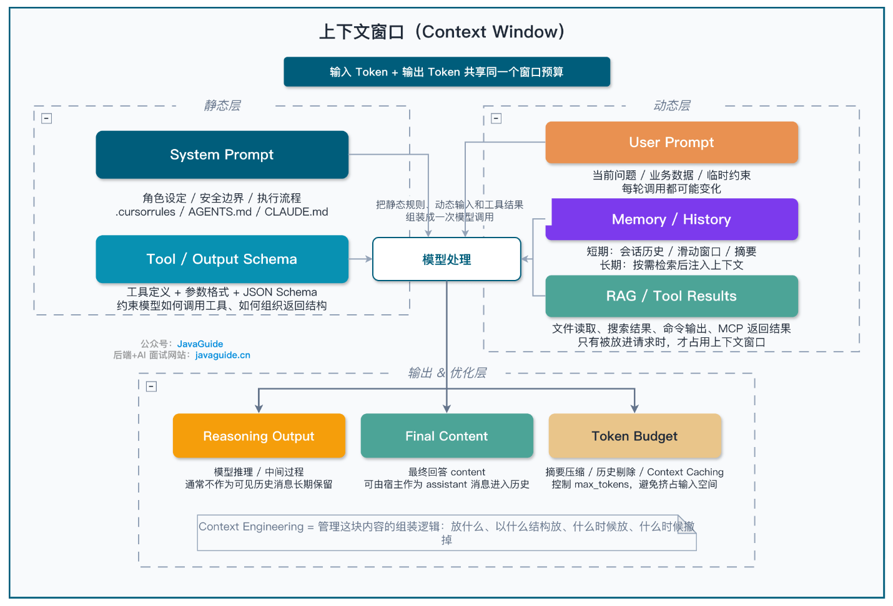

## LLM 运行机制

[LLM 运行机制：Token、上下文窗口与采样参数怎么影响输出](https://javaguide.cn/ai/llm-basis/llm-operation-mechanism.html)

### Token 及其影响

#### 基于历史 token 的预测

> 自回归生成：根据前面的历史，预测后面的输出。

如何去预测？一般来说需要模型自行识别历史 token 中哪些是相关性高的，哪些是相关性低的，选取高相关性的 token 更容易预测。因此，模型的一个重要参数是选取规则，目前有 Temperature / Top-p 等，选取规则本身是会影响模型预测精度的。

而选取 token 后，需要输出 token，这里引申另一个重要参数是 Max Tokens，即决定模型在单次预测中，最多可以输出的 token 总量。不过，这个参数并不会影响模型本身的预测精度，因为预测的结果是不变的，模型只是按照 max token 这个参数计算并输出，如果不够了截断就是了。

#### 分词器 Tokenizer

> 分词器 Tokenizer：将自然语言切分 token 的规则。

Tokenizer 本身是需要训练的，一旦训练好，此后均按照这套规则进行分词。

各大模型基本上会自己训练一套 Tokenizer，所以不同的模型直接的 token 计算规则不能划等号，有的模型可能用得多，有的模型可能用得少。

#### 特殊 token

这些 token 是不计入业务，只用于特殊标记的，比如

特殊 Token	|用途	|示例
----|----|----
BOS（Beginning of Sequence）|	标记序列开始|	\<s>
EOS（End of Sequence）|	标记序列结束|	\</s>
PAD（Padding）|	批处理时填充短序列|	\<pad>
工具调用标记|	Function Calling 边界|	\<tool_call/>

这些 token 对用户不可见，但也是会占用上下文的。

#### 多模态 token

最常见的多模态就是图片输入，图片是怎么转化为 token 的？

从直觉上看，图片本质上也只是一些体素，但是按照体素挨个挨个切分就占用太多 token 了，所以一般采用 CV 的一般方案，使用 CNN、ViT、ViM 这些视觉模型识图，然后转成 token。

#### 上下文窗口

图片上可以看到，静态输入+动态输入+输出共同占用上下文窗口，其中用户的 prompt 只占用很少的一段。

这是符合直觉的，我们一般调用 api 时，输入的自然语言如果转化成 token 远远小于控制台显示的 token 用量，或者在 cc 使用 /context 时上下文窗口远大于输入 prompt 的token，原因就是其余很大一部分进行了占用。

#### 上下文长度的影响

上下文太短太长都不合适。太短了会导致信息密度不够，llm 不能做出精确的预测。太长了更是问题一堆，最基本的问题就是影响性能，这是 Transformer 本身的缺陷。

> 长上下文导致的注意力分散

此外，上下文太长了还会出现另外一个更加严重问题，如果是性能问题还能通过堆硬件缓解，那么这个问题在实际应用上完全无法接受：上下文越长，信息就越多，模型的注意力越容易被无关信息（无关只是相对于当前任务而言，在其他任务中可能就是核心信息）分散，模型对于相关信息的注意力会减少，导致大模型选取的用于预测的历史 token 召回率急速降低，从而降低预测质量。

> 中间的历史很容易被忽略：Lost in the Middle 中间迷失

处于上下文中间的历史很容易被忽略，模型往往会下意识地更加注意开头与结尾的历史，和人为了了解主要内容而浏览文章时总喜欢看开头结尾了解大概内容一样，中间的历史很容易被刻意地忽略。

> 越远的历史普遍越容易被忽略（开头历史除外）

因为 Transformer 的限制，即`距离惩罚`，模型会更倾向于从最近的历史中选取用于预测的 token，这导致越往前的内容越容易被忽略。

然而，在近年的研究中，模型对最开头的几句话的注意力超出了原本的预想，产生的原因是模型将原本用于很多垃圾信息（对于业务作用很少的token）收回，并全部加到开头几句，导致模型对开头几句的注意力甚至会越来越强。

另外，虽然“越远的历史普遍越容易被忽略”这句话是一个普遍规律，但也不乏确实有部分远古历史，仅仅只是其相关性极高，这一点带来的增益就完全越过了距离带来的减益，从而被模型着重注意到的现象。

#### token 缓存

到底缓存了什么？并非是 token 本身，更不是根据 token 预测的结果，缓存起来的是模型内部庞大的`中间计算状态（矩阵数据）`，也即 `KV Cache`。

然后，按照前缀原则匹配。所以，调用 api 的时候，把不变的内容放到前面，变化的内容放到后面更容易命中缓存。

### 采样参数

#### 分数logits => 概率 => 真实输出

大模型本质是概率预测模型，需要根据历史 token 计算候选 token 得出的分数，然后计算候选 token 的概率，然后选择真正输出哪一个 token。

举个例子，假设模型正在补全“今天天气真__”，它可能给出这样的分数：

候选 Token|	原始分数（logit）
----|----
好|	5.0
不错|	3.2
棒|	2.1
糟糕|	0.5
紫色|	-8.0

经过一次 softmax：$$P_i = \frac{e^{z_i / T}}{\sum_{j} e^{z_j / T}}$$ 将分数转化为概率：

候选 Token|	概率
----|----
好|	62%
不错|	20%
棒|	10%
糟糕|	5%
紫色|	≈ 0%

然后，再根据每个候选 Token 的概率进行选择。

> 然而，假如这个地方输出 `好` 就是最佳的方案，如果按照目前的概率，输出 `好` 的概率并不算高，完全有可能输出 `不错` 或者其他 token。

此时有什么解决办法吗？有的，目前有三大参数可以用于强化高概率结果：

- Temperature：使高概率越高，低概率越低；

- Top-p & Top-k：砍掉低概率候选 token；

- Penalty 系列：减少已经出现 token 的分数，避免复读机

#### Temperature

主要发生在 `logits => 概率` 这一步，把分数除以一个 `T` 值，控制 T 的大小来控制概率的差值。

例如，如果我们想让输出 `好` 的概率变得很高，就令 `T=0.5`，那么 logits 表变为：

候选 Token|	原始分数（logit）
----|----
好|	10.0
不错|	6.4
棒|	4.2
糟糕|	1.0
紫色|	-16.0

经过 softmax 后：

候选 Token|	概率
----|----
好|	97.05%
不错|	2.65%
棒|	0.29%
糟糕|	0.01%
紫色|	≈ 0%

可以看到， `好` 的概率被极大提高了，此时大概率可以采样到该 token。

如果让 `T>1` ，那就会让各个概率差距变小，每个候选 Token 被采样的概率会变得差不多。

温度越低，输出越确定；温度越高，输出越随机。

#### Top-k & Top-p

- Top-k：保留前 k 个概率大的候选 token；

- Top-p：保留使累计概率恰好大于 90% 的最少个候选 token。例如从 `好` 到 `棒`，累计概率为 92% 已经超过了 90%，所以就仅保留这三个候选 token。

实践中 Top-p 更常用，因为它能自动适应不同的概率分布。

#### Penalty

Penalty 参数的共同点在于：给予重复 token 扣分，模型为了避免扣分就会尽量减少重复 token。具体在扣分规则上有三种参数：

参数	|作用|	通俗理解
---|---|---
Repetition Penalty	|降低所有已出现 Token 的概率|	“说过的词，再说就扣分”
Presence Penalty	|只要 Token 出现过就扣分（不看次数）|	“鼓励聊新话题”
Frequency Penalty	|Token 出现次数越多扣分越重|	“同一个词说了三遍？重罚”

> 陷阱：结构化输出时慎用 Penalty

有时候要求输出结构化内容，比如 JSON 等有固定格式、固定关键字的输出，这个时候就不要用 penalty 了，不然有让输出残缺的风险。

还有，在 RAG 里检索知识库时，如果用了 penalty，确实会让模型倾向于讨论新内容，但是更有可能会降低检索内容的忠实度，增加幻觉。

总而言之，一般情况下不建议使用。

#### 思维链模式

原因：思维链模式的设计目标是让模型“自由思考”，模型内部会有固定的采样策略，用户传入的采样参数会被忽略，例如 `Temperature` `top-k` `Presence Penalty` `Frequency Penalty`。

#### Logprobs 置信度排查

有的 api 可以输出每个 token 的对数概率 `logprobs`，越接近0表示越自信，越小则说明拿不准，需要人工审核。

#### 泛用采样决策

场景|	Temperature	|Top-p	|Penalty	|其他建议
---|---|---|---|---|
JSON / 结构化输出|	0 ~ 0.3|	1.0	|保持默认|	配合 Strict Mode + 重试策略
代码评审 / 技术分析|	0.4 ~ 0.7|	0.9	|保持默认|	结合 CoT Prompt
多轮对话	|0.6 ~ 0.8|	0.9	|适度开启|	控制历史消息长度
创意写作 / 头脑风暴|	0.8 ~ 1.2|	0.95|	按需开启|	接受输出多样性，做好后处理
思维链模型	|—（不支持）|	—	|—	|通过 Prompt 控制，非采样参数

> strict mode：结构化输出时采用，核心作用为强制大模型生成的 JSON 结果，100% 完美契合开发者预先定义的 JSON Schema（数据校验结构），杜绝任何遗漏字段、瞎编字段或数据类型错误的情况。

